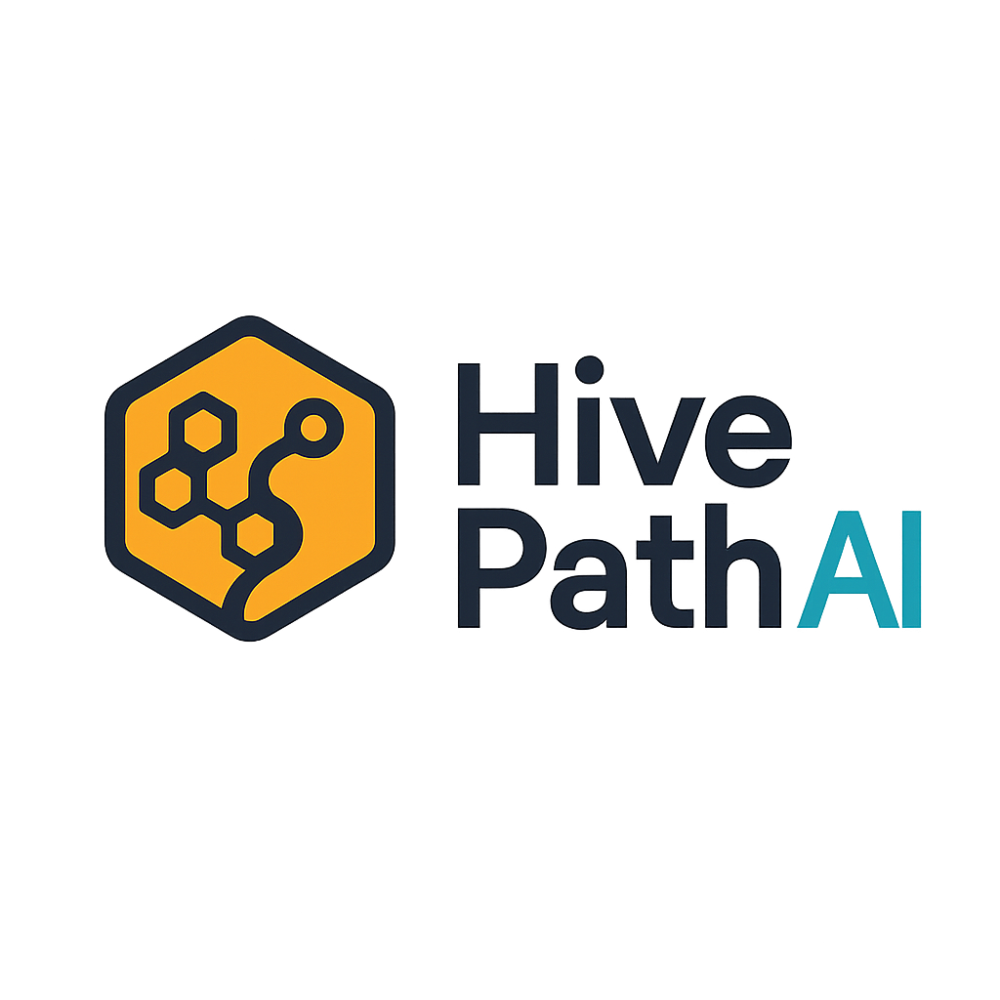

<div align="center">



# HivePath AI

### The routing engine that treats accessibility as a first-class constraint — not an afterthought.

[](#)

[](https://github.com/kbhatnagar1506/Hivepath-AI/actions/workflows/ci.yml)
[](LICENSE)
[](hivepath-ai/pyproject.toml)
[](hivepath-ai/docs/TESTING.md)
[](hivepath-ai/docs/TESTING.md#coverage-by-module)
[](CONTRIBUTING.md)

</div>

---

Every logistics optimizer on the market solves the same objective: minimize
distance, minimize time, minimize cost. That objective has a blind spot it
never has to answer for — **it doesn't know which stops are hard to reach, so
it drops them first, silently, every single time capacity runs short.**
HivePath is built around closing that blind spot at the objective-function
level, not with a dashboard warning bolted on afterward.

Given a depot, a fleet, and a list of stops, it plans routes under time
windows and capacity limits — same category as any commercial VRP engine. The
difference shows up exactly when it matters: when the fleet **can't serve
everything.** A standard optimizer sheds whatever is most awkward to reach.
HivePath makes awkward stops *more expensive to skip*, so the plan sheds easy
ones instead.

**Measured: +25 points of service rate for hard-to-reach stops, at zero cost
to overall throughput.** [See how, below](#the-numbers).

```bash
git clone https://github.com/kbhatnagar1506/Hivepath-AI.git
cd Hivepath-AI/hivepath-ai
pip install -e ".[dev]"
pytest                        # 190 tests, zero configuration required
python -m hivepath             # → http://localhost:8000/docs
```

---

## What HivePath does

Send it a depot, a fleet, and a list of stops. Get back a plan: which vehicle
visits which stops, in what order, arriving when, carrying how much load,
emitting how much CO₂ — and, if the fleet can't cover everyone, exactly which
stops were left out and why.

- **Capacitated routing with time windows.** The core solve — OR-Tools CVRPTW
  with per-vehicle capacity, per-stop delivery windows, and configurable speed
  and time-limit tradeoffs via four presets (`ultra_fast` → `quality`).
- **Accessibility-aware prioritization.** The one thing this project exists
  for: a stop's accessibility score raises the cost of dropping it, so a
  capacity-constrained solve keeps hard-to-reach stops rather than shedding
  them first. See [`#how-accessibility-enters-the-objective`](hivepath-ai/README.md#how-accessibility-enters-the-objective).
- **Real road distances, when you want them.** Google Distance Matrix with
  live traffic, correctly tiled to respect the API's element limits — or free
  haversine distances with no credentials at all. Every plan reports which one
  it actually used.
- **Kerbside accessibility scoring.** Given a lat/lng, fetch Street View
  imagery and score how hard it is to legally stop, park, and unload there —
  see [Machine Learning](#machine-learning) below for exactly what's doing the
  scoring and how much of it is actually "AI."
- **Disruption handling.** Report a blocked stop and get a replan in the same
  call, warm-started from the previous plan so routes don't reshuffle
  wholesale over one closed dock.
- **A typed REST API.** FastAPI, Pydantic-validated end to end — malformed
  input never reaches the solver. Full reference in
  [`hivepath-ai/README.md`](hivepath-ai/README.md#api).

**What it isn't, on purpose:** not a fleet-management platform, not a live-map
UI (the `integrated_dashboard/` Next.js app exists in this repo but predates
the current API and isn't wired to it), and not built for multi-instance
deployment yet — plans live in memory and don't survive a restart or a second
process. It's the routing core: solver, accessibility model, and API, meant to
sit underneath something bigger.

---

## Machine Learning

This section is here so nobody has to guess. Three things in this codebase
touch what could reasonably be called "AI," and here's exactly how deep each
one goes — no more, no less than what's actually running.

### 1. The routing itself: not ML

The actual routing — the part that decides which vehicle visits which stop in
what order — is [Google OR-Tools](https://developers.google.com/optimization),
a constraint solver, not a learned model. This is where almost all of the
engineering weight in this repository actually sits: a capacitated VRP with
time-window and capacity dimensions, per-stop drop disjunctions, and a
warm-started local search. It's correct and it's tested. It is not machine
learning, and nothing here claims otherwise.

### 2. Service-time prediction: a small MLP, off by default

[`hivepath.ml.service_time`](hivepath-ai/src/hivepath/ml/service_time.py)
predicts how many minutes a stop will take, feeding into the routing solve.
Two tiers, selected automatically:

- **Heuristic (what actually runs today):** closed-form arithmetic —
  `base_minutes + minutes_per_demand_unit × demand + max_surcharge × (1 − accessibility)`,
  clamped to a 3–120 minute range. Genuinely not ML. This is the model every
  deployment of this repository uses right now, because no trained checkpoint
  ships with it (see below).
- **Neural (optional, currently inactive):** a plain 3-layer feedforward
  network — `Linear(6→128) → ReLU → Linear(128→64) → ReLU → Linear(64→1)` —
  over demand, accessibility, hour, and weekday. That's the whole
  architecture. No attention, no recurrence, no graph structure. It activates
  only if `pip install -e ".[ml]"` (adds `torch`) **and** a checkpoint exists
  at `mlartifacts/service_time_mlp.pt` — which this repository does not ship.
  Train your own with `hivepath-ai/scripts/train_service_time.py` if you want
  to turn it on; until then, `get_service_time_model()` always resolves to the
  heuristic, and says so in the logs.

**On the Graph Neural Network this project used to claim:** it didn't hold up,
and it's been removed rather than left in place. An earlier version of this
codebase had a training script named for a GNN
(`train_service_time_gnn.py`) and a matching checkpoint
(`service_time_gnn.pt`). Neither actually was one — the training script's own
model class was a plain MLP, with a code comment reading *"here we keep simple
MLP for speed"* where the graph convolution was supposed to be. No adjacency
structure, no message passing, ever ran. That script, its checkpoint, and the
`torch-geometric` dependency it implied have all been deleted from this
repository (see [`legacy/README.md`](hivepath-ai/legacy/README.md) for the
full accounting) rather than kept around implying a capability that was never
real. If a genuinely graph-structured model — learning from stop-to-stop
routing history via real message passing — gets built here later, it'll be
documented with the same specificity as everything above, not before.

### 3. Accessibility scoring: a thin wrapper around an external vision model

`POST /api/v1/accessibility/analyze` doesn't run a model this project trained.
It fetches up to four Street View images for a location
([`integrations/street_view.py`](hivepath-ai/src/hivepath/integrations/street_view.py))
and sends them to an external multimodal chat model — OpenAI-compatible,
`gpt-4o-mini` by default — with a structured prompt asking for an access score
(0–100), hazards, and findings as JSON
([`integrations/vision.py`](hivepath-ai/src/hivepath/integrations/vision.py)).
The engineering here is entirely in what wraps that call, not in the model
itself: strict response validation, clamping every field to its documented
range, and *enforcing* — in code, not just requesting in the prompt — that any
critical hazard caps the score at 35 regardless of what the model returned.
Without an `OPENAI_API_KEY`, the endpoint returns `503`, not a plausible-looking
fabricated score.

### The honest summary

If you came here expecting a novel deep-learning architecture, that's not
what this is. If you came for a correct, tested, accessibility-weighted VRP
solver — with a couple of small, honestly-labeled, optional ML components,
and a clean seam to plug in better ones later — that's exactly what this is.

---

## Infrastructure

Same policy as the Machine Learning section above: what's here, stated
plainly, nothing implied that isn't real.

**What's actually running:**

- **CI** — [`.github/workflows/ci.yml`](.github/workflows/ci.yml), three jobs
  on every push and PR to `main`: the full test suite across Python 3.11,
  3.12, and 3.13; a coverage report; and `ruff` lint. All three currently
  pass. This is genuinely load-bearing — it's what lets the test-count and
  coverage badges at the top of this page mean something instead of being
  copied from a local run and quietly going stale.
- **Storage** — in-memory, single-process, explicitly not durable. Plans and
  blocked-stop state are lost on restart. See
  [`hivepath-ai/docs/ARCHITECTURE.md#7-storage-whats-durable-and-what-isnt`](hivepath-ai/docs/ARCHITECTURE.md#7-storage-whats-durable-and-what-isnt).

**What doesn't exist yet:**

- **No deployment pipeline.** CI runs tests; nothing builds a container,
  publishes an image, or deploys anywhere automatically. `uvicorn
  hivepath.api.application:app` is the whole runbook right now — see
  [Deployment](hivepath-ai/README.md#deployment) for what that requires
  before running more than one instance.
- **No hosted instance.** There is no live URL where this service is running
  publicly. If you see one claimed anywhere for this project, it's stale.

**One thing worth naming directly, since it causes visible noise on every
push:** this repository's commits carry a failing "Cloudflare Pages" check,
from a Cloudflare GitHub App connected outside of any file tracked in this
repo — there's no `wrangler.toml`, no Pages build config, and no static
frontend at a path Cloudflare's auto-detection could resolve anywhere here.
It isn't deploying anything; it's failing on a build target that doesn't
exist in the tracked code, every time. It is not part of this project's
design, and removing it needs the repo owner's Cloudflare/GitHub account
access, not something fixable from within this codebase. If you see this
check failing on a commit, that's why — it's safe to ignore, and unrelated
to whether the actual CI (above) passed. The separate `cloudflare-integration/`
directory some earlier commits reference (a manual Workers AI + R2 setup) was
unrelated to it and was removed as unused — see
[`hivepath-ai/legacy/README.md`](hivepath-ai/legacy/README.md).

---

## How it stacks up

|  | Distance-only VRP<br>*(typical commercial stack)* | HivePath AI |
|---|---|---|
| Objective function | Minimize distance / time / cost | Minimize distance / time / cost **+ accessibility-weighted drop cost** |
| When capacity runs short | Drops whichever stop is costliest to reach — usually the hard address | Drops the *easiest* stop first; hard-to-reach stops are kept in the plan |
| Accessibility data | Not modeled | 0–100 score per stop, from vision-scored Street View imagery or supplied directly |
| No credentials configured | Often won't start, or silently no-ops a feature | **Starts and solves routes with zero credentials.** Degraded features report their own fallback |
| Distance source transparency | Rarely exposed | Every plan reports `matrix_source`: `haversine` or `google_maps` — never claims one while using the other |
| Disruption response | Full manual re-plan | `POST /incidents` blocks a stop and replans in one call, warm-started from the previous plan |
| Failure mode on partial infeasibility | Often a hard error | 200 OK with `ok: false` and a reason, or a partial plan with `dropped_stop_ids` — never a crash for a well-formed problem |
| Test suite | Frequently absent or unverifiable from outside | 190 tests, 86% coverage, runnable by anyone who clones the repo |
| License | Often proprietary | MIT — fork it, run it, change it |
| Impact claims | Marketing figures | `scripts/benchmark_impact.py` — run it yourself, seed included |

---

## The numbers

`hivepath-ai/scripts/benchmark_impact.py` runs the same solver twice per
scenario — accessibility weighting on, then off — so the only variable is the
feature itself. 59 scenarios, 14–22 stops, fleet capacity deliberately set to
72% of total demand to force real trade-offs:

```bash
cd hivepath-ai && python scripts/benchmark_impact.py --trials 60
```

**Equity** — service rate for hard-to-reach stops (access score < 35):

| | Service rate |
|---|---|
| Accessibility weighting **on** | **100%** |
| Accessibility weighting **off** | ~75% |
| Difference | **+25 points** |

Overall service rate is 73.5% either way — the fleet is capacity-limited, so
this is not "serve more stops." It is **the same number of stops, chosen
differently.** With weighting on, no hard-to-reach stop was dropped in any of
the 59 scenarios; the plan drops easier ones instead.

**Efficiency** — optimized plan vs. serving the manifest in submitted order,
which is what happens without an optimizer:

| | Result |
|---|---|
| Mean optimized distance | ~41 km |
| Mean unoptimized distance | 58.0 km |
| **Reduction** | **~27%** |
| CO₂ avoided per run | ~14 kg (diesel) |

> These are synthetic scenarios measuring solver behaviour, not field-observed
> delivery outcomes. Full methodology, the reproducibility caveat, and the
> honest limits of what this proves are in
> [`hivepath-ai/README.md`](hivepath-ai/README.md#the-numbers) — read it
> before citing these numbers anywhere.

---

## Why this exists

A route optimizer minimizing distance or time treats every stop as
interchangeable. It isn't. A stop with no legal kerbside parking, a blocked
loading bay, or stairs-only access costs more to serve — so when capacity runs
short, a distance-minimizing objective drops it **first, and every time.**
Nobody configures that outcome. It falls out of the math by default, and it
compounds silently, one route at a time, forever, unless something in the
objective function pushes back.

Those aren't randomly distributed addresses, either. They skew toward older
housing stock, dense blocks, and buildings that never got a loading dock —
which means the "efficient" route is systematically less efficient at serving
exactly the people who already have the fewest alternatives.

HivePath inverts that default at the source: inside the objective function
itself, not in a report generated after the fact.

---

## What's actually in this repository

The project is `hivepath-ai/` — that's where the code, tests, and docs live.
Everything else is context, kept rather than deleted:

```
Hivepath-AI/
├── hivepath-ai/            The service. Start here.
│   ├── src/hivepath/       190 tests' worth of typed, tested Python
│   ├── tests/              pytest, hermetic, 86% coverage
│   ├── docs/                ARCHITECTURE.md and TESTING.md — the deep dives
│   ├── scripts/             benchmark_impact.py and ML training scripts
│   └── legacy/               superseded backend + 21 old scripts, kept with
│                             a migration map, not deleted
├── assets/                  logo, architecture diagrams, and dashboard
│                             screenshots from an earlier presentation of
│                             this project — historical, not current output
├── legacy-frontend/         a single static HTML page from an even earlier
│                             version of this project (then called SwarmAura)
├── LICENSE                  MIT
├── CONTRIBUTING.md          how to set up, test, and submit a PR
├── SECURITY.md              how to report a vulnerability
└── CODE_OF_CONDUCT.md
```

**[→ hivepath-ai/README.md](hivepath-ai/README.md)** — the full project README:
API reference, the accessibility penalty formula and its guarantees,
degradation behavior without credentials, and the complete benchmark
methodology.

**[→ hivepath-ai/docs/ARCHITECTURE.md](hivepath-ai/docs/ARCHITECTURE.md)** —
every design decision, stated as the defect it replaced. The request
lifecycle traced module by module, what's inside the OR-Tools model, and what
was deliberately left out of scope.

**[→ hivepath-ai/docs/TESTING.md](hivepath-ai/docs/TESTING.md)** — the
isolation model, a full test inventory, the coverage table, and ten
regressions walked through individually.

---

## Contributing

Issues and PRs are welcome. Read [CONTRIBUTING.md](CONTRIBUTING.md) first —
the short version is: name bug-fix tests after the bug, keep the domain typed,
never let a feature fail silently, and don't add a comment that just restates
the code above it.

## License

[MIT](LICENSE) — fork it, run it, ship it, change what you disagree with.
