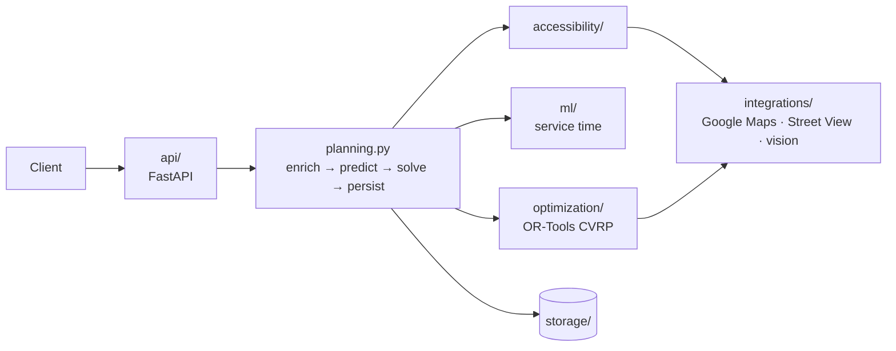

# HivePath AI

### The routing engine that treats accessibility as a first-class constraint — not an afterthought.

Every logistics optimizer on the market solves the same objective: minimize
distance, minimize time, minimize cost. That objective has a blind spot it
never has to answer for — **it doesn't know which stops are hard to reach, so
it drops them first, silently, every single time capacity runs short.**
HivePath is built around closing that blind spot at the objective-function
level, not with a dashboard warning bolted on afterward.

Given a depot, a fleet, and a list of stops, it plans routes under time windows
and capacity limits — same category as any commercial VRP engine. The
difference shows up exactly when it matters: when the fleet **can't serve
everything.** A standard optimizer sheds whatever is most awkward to reach.
HivePath makes awkward stops *more expensive to skip*, so the plan sheds easy
ones instead. Measured below: **+25 points of service rate for hard-to-reach
stops, at zero cost to overall throughput.**

```bash
cp .env.example .env          # optional — every value has a working default
pip install -e ".[dev]"
pytest                        # 190 tests, 85% coverage
python -m hivepath            # http://localhost:8000/docs
```

---

## How it stacks up

|  | Distance-only VRP<br>*(typical commercial stack)* | HivePath AI |
|---|---|---|
| Objective function | Minimize distance / time / cost | Minimize distance / time / cost **+ accessibility-weighted drop cost** |
| When capacity runs short | Drops whichever stop is costliest to reach — usually the hard address | Drops the *easiest* stop first; hard-to-reach stops are kept in the plan |
| Accessibility data | Not modeled | 0–100 score per stop, from vision-scored Street View imagery or supplied directly |
| No credentials configured | Often won't start, or silently no-ops a feature | **Starts and solves routes with zero credentials.** Degraded features report their own fallback |
| Distance source transparency | Rarely exposed | Every plan reports `matrix_source`: `haversine` or `google_maps` — never claims one while using the other |
| Disruption response | Full manual re-plan | `POST /incidents` blocks a stop and replans in one call, warm-started from the previous plan |
| Failure mode on partial infeasibility | Often a hard error | 200 OK with `ok: false` and a reason, or a partial plan with `dropped_stop_ids` — never a crash for a well-formed problem |
| Test suite | Frequently absent or unverifiable from outside | 190 tests, 85% coverage, runnable by anyone who clones the repo |
| Impact claims | Marketing figures | `scripts/benchmark_impact.py` — run it yourself, seed included |

---

## Why this exists

A route optimizer minimizing distance or time treats every stop as
interchangeable. It isn't. A stop with no legal kerbside parking, a blocked
loading bay, or stairs-only access costs more to serve — so when capacity runs
short, a distance-minimizing objective drops it **first, and every time.**
Nobody configures that outcome. It falls out of the math by default, and it
compounds silently, one route at a time, forever, unless something in the
objective function pushes back.

Those aren't randomly distributed addresses, either. They skew toward older
housing stock, dense blocks, and buildings that never got a loading dock —
which means the "efficient" route is systematically less efficient at serving
exactly the people who already have the fewest alternatives.

HivePath inverts that default at the source: inside the objective function
itself, not in a report generated after the fact. Accessibility raises the
cost of leaving a stop unserved, so the solver keeps it. This is the single
idea the whole system is built to protect.

### The numbers

`scripts/benchmark_impact.py` runs the same solver twice per scenario —
accessibility weighting on, then off — so the only variable is the feature
itself. 59 scenarios, 14–22 stops, fleet capacity deliberately set to 72% of
total demand to force real trade-offs:

```bash
python scripts/benchmark_impact.py --trials 60
```

**Equity** — service rate for hard-to-reach stops (access score < 35):

| | Service rate |
|---|---|
| Accessibility weighting **on** | **100%** |
| Accessibility weighting **off** | ~75% |
| Difference | **+25 points** |

Overall service rate is 73.5% either way — the fleet is capacity-limited, so
this is not "serve more stops". It is **the same number of stops, chosen
differently.** With weighting on, no hard-to-reach stop was dropped in any of
the 59 scenarios; the plan drops easier ones instead.

**Efficiency** — optimized plan vs. serving the manifest in submitted order,
which is what happens without an optimizer:

| | Result |
|---|---|
| Mean optimized distance | ~41 km |
| Mean unoptimized distance | 58.0 km |
| **Reduction** | **~27%** |
| CO₂ avoided per run | ~14 kg (diesel) |

**On reproducibility:** the seed fixes the scenarios, so the problem set and the
58.0 km unoptimized baseline are identical on every run. The solver results are
not bit-identical, because `time_limit_sec` is wall-clock — how much search
completes depends on machine load. Across runs the figures move by a few tenths
of a point (75.5% / 75.1%, 27.0% / 27.3%), which is why they are quoted as
approximate. Re-run it yourself rather than taking these numbers on faith.

> These are **synthetic scenarios measuring solver behaviour**, not
> field-observed delivery outcomes. They show what the software does under
> controlled conditions. Real fleets have curb-time variance, driver knowledge,
> and traffic that this does not model. Treat them as a lower bound on the
> question "does the feature do anything" and nothing more.

---

## How accessibility enters the objective

`access_score` is **0–100**, higher meaning easier to reach. In an OR-Tools
disjunction the penalty is what the objective pays for leaving a stop unserved,
so raising it makes a stop more likely to be visited:

```
drop_penalty = priority × penalty_per_priority
             + weight × drop_penalty × (100 − access_score)
```

At the 0.002 default, a fully inaccessible stop costs 20% more to skip than a
fully accessible one. Three properties worth stating plainly:

- **`access_score: null` means unassessed**, and is treated neutrally — which is
  deliberately different from an assessed score of 50. Absence of evidence is
  not evidence of inaccessibility.
- **It never overrides priority.** A priority-3 stop still outranks a
  priority-1 stop regardless of accessibility. Accessibility breaks ties within
  a priority band; it does not reorder the bands.
- **It scales with the preset.** The weight is a fraction of the base penalty,
  so raising `drop_penalty_per_priority` raises the accessibility term with it.

Where scores come from: Street View imagery scored by a vision model
(`POST /api/v1/accessibility/analyze`), or supplied directly on each stop. Both
optional — the solver runs fine without either.

---

## Degradation

The service starts and solves routes with **no credentials at all.** Features
that need a key fall back and *say so* in the response, rather than failing or
quietly pretending:

| | Without credentials | With credentials |
|---|---|---|
| Distances | Haversine (`matrix_source: "haversine"`) | Google roads + live traffic (`matrix_source: "google_maps"`) |
| Accessibility | Stops stay `access_score: null` | Street View + vision model score each kerbside |
| Service times | Heuristic (demand + accessibility) | Trained model, when a checkpoint is present |

Every plan carries a `telemetry` block reporting which path actually ran, so a
result can never claim road distances it didn't use.

---

## API

All endpoints under `/api/v1`. Interactive docs at `/docs`.

| Method | Path | Purpose |
|---|---|---|
| `GET` | `/health` | Status and which integrations have credentials |
| `POST` | `/optimize/routes` | Plan routes |
| `GET` | `/plans/{run_id}` | Fetch a stored plan |
| `GET` | `/plans/{run_id}/metrics` | Distance, emissions, service rate |
| `POST` | `/incidents` | Block a stop, optionally replan |
| `GET` | `/incidents` | List active blocks |
| `DELETE` | `/incidents/{stop_id}` | Clear a block |
| `POST` | `/accessibility/analyze` | Score kerbside access at a location |

```bash
curl -X POST localhost:8000/api/v1/optimize/routes \
  -H 'Content-Type: application/json' -d '{
  "run_id": "morning",
  "depot": {"id": "hub", "lat": 42.3601, "lng": -71.0589},
  "vehicles": [{"id": "v1", "capacity": 200, "fuel_type": "ev"}],
  "stops": [
    {"id": "s1", "lat": 42.3651, "lng": -71.0489, "demand": 40},
    {"id": "s2", "lat": 42.3551, "lng": -71.0689, "demand": 40, "access_score": 20}
  ]
}'
```

A well-formed problem with no solution returns **200 with `ok: false`** and a
reason. A 5xx means the service itself failed. Over-capacity requests return a
partial plan with `dropped_stop_ids` populated — not an error, because a partial
plan is still the plan you want.

### Presets

`ultra_fast`, `fast`, `balanced`, `quality` set solver defaults. Anything you
set explicitly still wins, so a preset is a starting point, not a straitjacket.

### Disruptions

`POST /incidents` blocks a stop for a TTL and can replan in one call. The replan
seeds its search from the previous plan, so routes stay close to what drivers
already have rather than reshuffling wholesale after one blocked dock.

---

## Architecture


```mermaid
flowchart LR
    C[Client] --> API[api/<br/>FastAPI]
    API --> PLAN[planning.py<br/>enrich → predict → solve → persist]
    PLAN --> ACC[accessibility/]
    PLAN --> ML[ml/<br/>service time]
    PLAN --> SOLVER[optimization/<br/>OR-Tools CVRP]
    ACC --> INT[integrations/<br/>Google Maps · Street View · vision]
    SOLVER --> INT
    PLAN --> STORE[(storage/)]
```

```
src/hivepath/
├── config.py           Settings — the only place env vars are read
├── logging_config.py   Structured logging (JSON in production)
├── domain/             Typed core models (Depot, Stop, Vehicle, Route, Plan)
├── optimization/
│   ├── solver.py       OR-Tools CVRP with time windows
│   ├── distance.py     Haversine and Google matrix providers
│   ├── penalties.py    Drop-penalty model — where accessibility enters
│   └── warm_start.py   Sweep-based initial routes
├── ml/service_time.py  Service-time prediction (neural, heuristic fallback)
├── accessibility/      Street View assessment, policy, stop enrichment
├── integrations/       Google Maps, Street View, vision model clients
├── storage/            Plan, request, and incident repositories
├── planning.py         Pipeline: enrich → predict → solve → persist
└── api/                FastAPI app, routes, request/response schemas

tests/                  190 tests
scripts/                benchmark_impact.py, model training
legacy/                 superseded code — see legacy/README.md
```

Pipeline order matters: accessibility runs **before** service-time prediction,
because `access_score` is an input feature to that model — this is a named
regression test (`test_accessibility_runs_before_service_time_prediction`),
because it broke exactly this way once already.

**[Read the full architecture doc →](docs/ARCHITECTURE.md)** — the request
lifecycle traced end to end, what's inside the OR-Tools model (dimensions,
disjunctions, warm start), the two-provider distance system and why its
`matrix_source` label can be trusted, the accessibility pipeline, and every
design decision's reason for existing, stated as the defect it replaced.

---

## Testing

```bash
pytest                              # full suite
pytest tests/test_solver.py -v
pytest -k accessibility
python -m coverage run --source=src/hivepath -m pytest && python -m coverage report
```

**190 passed in ~70s.** Coverage 85% overall, concentrated exactly where it
should be:

| Module | Coverage | | Module | Coverage |
|---|---|---|---|---|
| `api/schemas.py` | 99% | | `storage/repositories.py` | 96% |
| `config.py` | 99% | | `optimization/penalties.py` | 95% |
| `optimization/solver.py` | 98% | | `planning.py` | 95% |
| `domain/models.py` | 98% | | `optimization/warm_start.py` | 94% |

The uncovered 15% is concentrated in the network-calling clients
(`integrations/`), which the suite deliberately does not exercise — an autouse
fixture blanks all credentials, so no test reaches the internet.

| Test file | Tests | Guards |
|---|---:|---|
| `test_api.py` | 25 | Full HTTP contract, every preset, 503/422/404 paths |
| `test_solver.py` | 21 | Capacity, time windows, the crash on `allow_drop=False` |
| `test_accessibility.py` | 19 | Vision-response validation, fail-open behavior |
| `test_domain.py` | 17 | Model invariants, time-window parsing |
| `test_warm_start.py` | 14 | The depot bug that silently disabled warm starts |
| `test_config.py` / `test_distance.py` / `test_planning.py` / `test_storage.py` | 13 each | Env parsing, Google tiling limits, pipeline order, thread safety |
| `test_service_time.py` | 12 | The 0–100 → 0–1 scale bug |
| `test_penalties.py` | 12 | The exact truncation-to-zero regression |

Most of these are named after the defect they guard against, not the feature
they exercise — `test_penalty_is_nonzero_at_default_weight`,
`test_strips_depot_so_ortools_accepts_the_seed`,
`test_accessibility_runs_before_service_time_prediction`. Two spin up real
threads to prove concurrent writes to shared state aren't lost.

**[Read the full testing doc →](docs/TESTING.md)** — the isolation model, a
per-file breakdown of what's verified, the coverage table with every module,
ten regressions walked through individually, and what's deliberately left
untested and why.

---

## Configuration

Everything lives in `.env`; `.env.example` is the annotated full list. Nothing
in the package calls `os.getenv` directly. Credentials are `SecretStr`, so they
don't surface in logs or tracebacks — there's a test asserting that.

`GOOGLE_STREET_VIEW_API_KEY` is optional and falls back to
`GOOGLE_MAPS_API_KEY`; they're the same Google Maps Platform credential unless
you deliberately scope them apart.

One caveat worth knowing: **`SOLVER_NUM_WORKERS` does not parallelise the
default search.** OR-Tools' guided local search is single-threaded and
`RoutingSearchParameters` exposes no worker count; the value reaches CP-SAT's
`num_workers`, which only applies if CP-SAT is enabled. To spend more compute on
a solve, raise `SOLVER_TIME_LIMIT_SEC`.

---

## Deployment

```bash
uvicorn hivepath.api.application:app --host 0.0.0.0 --port 8000
```

Set `ENVIRONMENT=production` for JSON logs and to disable auto-reload.

Plans are held in memory and are lost on restart. Before running more than one
instance, swap `storage/repositories.py` for a durable backend — the repository
interface exists to make that a contained change.
