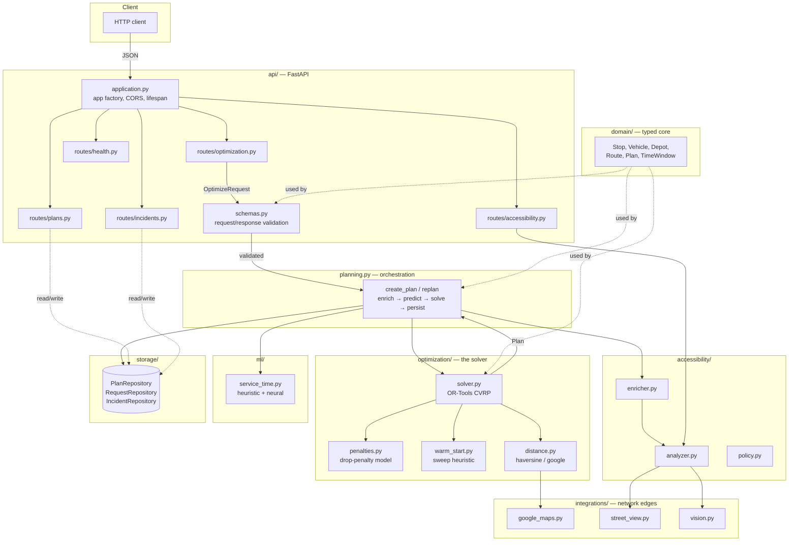
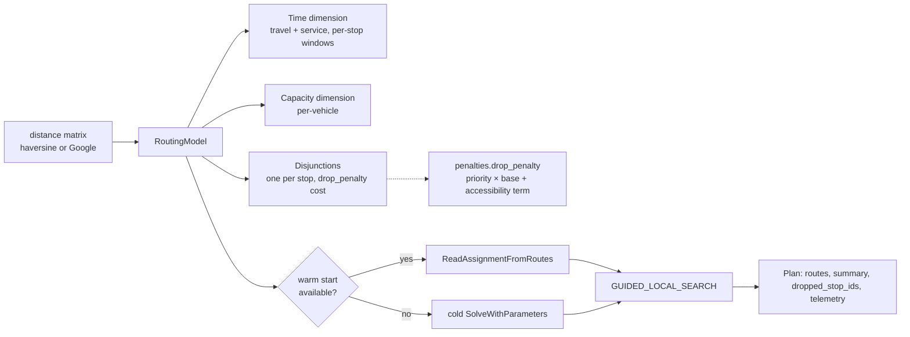

# Architecture

This document is a map of how HivePath is built and why the boundaries are
where they are. It assumes you've read the [README](../README.md) for *what*
the system does; this is about *how*.

---

## 1. Design principles

Four decisions shape everything else in this codebase. Each one exists because
its absence was a real defect in the codebase this replaced.

### The domain layer is typed, not dicts

Every value that crosses a module boundary is a dataclass
(`Stop`, `Vehicle`, `Depot`, `Route`, `Plan`, ...), never a bare `dict`. The
previous implementation passed untyped dicts everywhere, which is how a caller
came to invoke `solve_vrp(..., use_google_maps=True)` against a solver that had
never declared that parameter — nothing checked the shape until it hit
production. See [`domain/models.py`](../src/hivepath/domain/models.py).

### Configuration has exactly one source

[`config.py`](../src/hivepath/config.py) defines a single `Settings` object,
loaded once from `.env` and environment variables. No other module calls
`os.getenv`. The previous codebase read six different environment variable
names across six files — including two different names
(`GOOGLE_MAPS_API_KEY` / `GOOGLE_STREET_VIEW_API_KEY`) for what turned out to
be the same credential — each frozen at import time, which is a different
value depending on *when* a module happened to be imported.

### Every fallback is visible, not silent

When a feature can't run at full capability — no Google Maps key, no vision
model, no trained checkpoint — it downgrades to a documented fallback and
*reports which path it took*, in the response payload, not just a log line.
A `Plan`'s `telemetry.matrix_source` is `"haversine"` or `"google_maps"`
depending on what actually happened, never what was requested. This one
property is worth stating precisely because getting it wrong is the failure
mode that's hardest to notice: a system that silently falls back and claims
success looks identical to one that worked, right up until someone checks the
numbers against reality.

### ML is additive, never load-bearing

The solver, the API, and the whole request path work correctly with zero ML
dependencies installed. `torch` is an optional extra (`pip install -e ".[ml]"`)
gating a small feedforward network, not a graph model - no `torch-geometric`
dependency exists in this codebase. Its absence downgrades the service-time
model to a closed-form heuristic, not an error. See
[`ml/service_time.py`](../src/hivepath/ml/service_time.py) and the root
[README's Machine Learning section](../../README.md#machine-learning) for
exactly what that model is and isn't.

---

## 2. System overview



Everything below `planning.py` in this diagram is importable and testable
without FastAPI running — `pytest tests/test_solver.py` never starts a server.
That separation is deliberate: the HTTP layer is a thin adapter, not where the
logic lives.

---

## 3. Request lifecycle: `POST /api/v1/optimize/routes`

Tracing one request end to end, because it touches almost every module:

1. **`api/routes/optimization.py`** receives the JSON body. FastAPI validates
   it against `OptimizeRequest` in **`api/schemas.py`** before any application
   code runs — malformed coordinates, duplicate stop IDs, negative demand, and
   unknown fields are all rejected here with a 422, never reaching the solver.

2. **`planning.create_plan()`** is the single orchestration point:

   ```
   depot, stops, vehicles = request.to_domain(...)      # dicts → typed dataclasses
   options = build_solver_options(request, settings)     # preset + overrides resolved
   stops = await AccessibilityEnricher(...).enrich(stops)  # (A) — see note below
   stops = apply_service_times(stops)                     # (B)
   blocked = get_incident_repository().active_ids()
   plan = await asyncio.to_thread(solve_vrp, depot, stops, vehicles, options, ...)
   get_plan_repository().save(request.run_id, plan.to_dict())
   ```

   **Stage order is load-bearing, not incidental.** `access_score` is an input
   feature to the service-time model — a stop that's hard to reach usually
   takes longer to service too. Enrichment must populate that score *before*
   prediction reads it. This is a named regression test:
   `test_accessibility_runs_before_service_time_prediction` in
   [`tests/test_planning.py`](../tests/test_planning.py).

3. **`AccessibilityEnricher.enrich()`** (stage A) is a no-op — by design, not
   by accident — when Street View or vision-model credentials are absent. It
   never fabricates a plausible-looking average; unassessed stops keep
   `access_score = None`, which the penalty model treats differently from an
   assessed score of 50.

4. **`apply_service_times()`** (stage B) asks
   `ml.service_time.get_service_time_model()` for a prediction per stop. That
   function resolves — once per process, cached — to either a trained neural
   model (if `torch` is installed *and* a checkpoint exists at
   `ARTIFACTS_DIR/service_time_mlp.pt`) or `HeuristicServiceTimeModel`, a
   closed-form function of demand and accessibility. Both implement the same
   `ServiceTimeModel` interface, so the caller never branches on which one is
   active.

5. **`solve_vrp()`** in **`optimization/solver.py`** does the actual routing.
   Detailed in §4 below. It runs inside `asyncio.to_thread` because OR-Tools is
   CPU-bound native code with no meaningful `await` points — running it
   directly on the event loop would stall every other in-flight request for
   the duration of the solve.

6. The resulting `Plan` is serialized (`Plan.to_dict()`) and written to
   **`storage.PlanRepository`**, keyed by `run_id`, so `GET /plans/{run_id}`
   and a later `POST /incidents` replan can retrieve it.

7. **`api/routes/optimization.py`** wraps the domain error surface into HTTP
   status codes: a `ValueError` from validation becomes 422; anything else
   unexpected becomes 500 with the exception logged (`logger.exception`, full
   traceback) — never a bare `except: pass` swallowing the cause, which is
   exactly what hid the previous codebase's broken `predict_minutes` import
   for as long as it went unnoticed.

---

## 4. Inside the solver

[`optimization/solver.py`](../src/hivepath/optimization/solver.py) builds one
OR-Tools `RoutingModel` per solve. The pieces, in the order they're added:



**Time dimension.** One arc-cost callback returns `travel_time + service_time`
at the origin node, so waiting and serving are both charged against the
vehicle's time budget, not just movement. Each stop's `CumulVar` is bounded by
its `TimeWindow`; a stop with no window gets the full 24-hour range rather than
a zero-width one — collapsing an unparseable window to `(0, 0)` would make that
stop mathematically unservable, which is worse than being permissive.

**Capacity dimension.** A standard `AddDimensionWithVehicleCapacity` over
per-stop demand, bounded by each vehicle's `capacity`.

**Disjunctions and the accessibility penalty.** Every stop gets
`AddDisjunction([node], penalty)` — OR-Tools' mechanism for "this can be
skipped, at this cost." The penalty is computed in
[`penalties.py`](../src/hivepath/optimization/penalties.py):

```
drop_penalty = priority × penalty_per_priority
             + access_weight × (priority × penalty_per_priority) × (100 − access_score)
```

This is where the system's entire thesis lives, so it's worth being precise
about its history: the original formula was
`int(0.002 × (100 − access_score))`, whose *maximum possible value* before
truncation is `0.2` — `int()` floors that to zero for every score. The
accessibility term never fired, on any input. The fix scales by the base
penalty rather than a fixed constant, so it survives integer truncation and
scales with whatever `drop_penalty_per_priority` the active preset chose. Test:
`test_penalty_is_nonzero_at_default_weight`.

**Warm start.** [`warm_start.py`](../src/hivepath/optimization/warm_start.py)
builds an initial feasible-ish route set with a sweep heuristic (sort stops by
bearing from the depot, deal into vehicles, repair capacity violations) and
hands it to `ReadAssignmentFromRoutes`. OR-Tools requires that input contain
**only customer nodes** — the depot is implicit at each route's start and end.
The previous implementation included the depot sentinel in every route,
which OR-Tools rejects outright (`Index 0 is used multiple times`); the
rejection was silently treated as "no warm start available," so every solve
ran cold with no visible symptom. `validate_routes()` now strips the depot,
drops out-of-range nodes, and de-duplicates before the assignment is built —
and the plan's `telemetry.warm_started` field reports whether the warm start
was actually accepted, not just attempted.

**Search.** `PATH_CHEAPEST_ARC` for the first solution,
`GUIDED_LOCAL_SEARCH` to improve it, bounded by `time_limit_sec`. This
parameter block is built unconditionally at the top level of the function —
previously it was nested inside `if allow_drop:`, so a `quality` preset
(which used to force `allow_drop=False`) reached `SolveWithParameters(params)`
with `params` never assigned.

**Output.** `_extract_plan()` walks each vehicle's route from OR-Tools'
solution, accumulating distance, drive time, load, and CO₂
(`Vehicle.co2_kg_per_km × distance`) per leg. Any customer node the solution
never visits is reported in `Plan.dropped_stop_ids` — whether it was dropped by
the disjunction or excluded up front as `blocked_stop_ids`.

---

## 5. Distance: two providers, one honest label

[`optimization/distance.py`](../src/hivepath/optimization/distance.py) defines
`DistanceMatrix { distance_km, duration_min, source }`. `source` is set by
whichever code path actually produced the numbers, computed in this order:

1. If `use_google_maps=False` → haversine, unconditionally.
2. If `use_google_maps=True` but no `GOOGLE_MAPS_API_KEY` → haversine, logged
   at `INFO` (this is an expected, not exceptional, condition).
3. If the Google request raises for any reason (quota, network, malformed
   response) → haversine, logged at `WARNING` with the exception attached.
4. Otherwise → Google, and `source = "google_maps"`.

The Google client itself
([`integrations/google_maps.py`](../src/hivepath/integrations/google_maps.py))
tiles requests to respect the Distance Matrix API's hard caps — 25 origins, 25
destinations, 100 elements per call — computed by `_tile_sizes()`. The previous
client issued one unbounded request per solve, which silently exceeded the
element cap for any fleet above roughly ten stops.

---

## 6. Accessibility: assessment, policy, and the scale conversion

Three modules, three responsibilities:

- **`integrations/vision.py`** talks to the vision model, validates its JSON
  response against the documented schema (`validate_analysis()`), and clamps
  every field rather than trusting the model's arithmetic — a critical hazard
  is *enforced* to cap the score at 35 in code, not merely requested in the
  prompt.
- **`accessibility/analyzer.py`** fetches Street View frames concurrently
  (bounded by a semaphore), calls the vision model, and — critically — never
  raises. Any failure anywhere in that chain downgrades to `NEUTRAL_RESULT`
  with `assessed: False`, distinct from a genuine middling score.
- **`accessibility/enricher.py`** is the boundary the solver actually sees:
  it populates `Stop.access_score` and `Stop.service_min`, skipping stops that
  already carry a score unless `overwrite=True`.
- **`accessibility/policy.py`** turns an assessment into a block/warn decision
  for the `/accessibility/analyze` endpoint, independent of the solver's
  penalty math — this is advisory information for a dispatcher, not something
  that feeds back into routing directly.

**The scale conversion.** The domain and the API use **0–100** throughout.
The ML models (`ml/service_time.py`) were trained on **0–1**.
`Stop.access_fraction` is the *only* place that conversion happens — dividing
by 100 when a score is present, defaulting to `0.6` (the training-set median)
when it's `None`. The previous heuristic fed a 0–100 score directly into a
formula written for 0–1, computing `5 × (1 - 50) = -245` for a mid-range
stop — clamped to the 3-minute floor regardless of actual demand or
accessibility, silently collapsing the model's output to a constant.

---

## 7. Storage: what's durable and what isn't

[`storage/repositories.py`](../src/hivepath/storage/repositories.py) defines
three in-memory repositories behind a bounded, thread-safe `_BoundedStore`
(FIFO eviction past `max_entries`, so a long-lived process can't grow without
limit) and a lock (FastAPI serves sync endpoints from a thread pool, so
concurrent access is real, not theoretical — there's a threaded test proving
no writes are lost under contention).

**This is explicitly not durable.** Plans and blocked-stop state are lost on
restart. That's a stated limitation, not an oversight: the repository classes
exist as an interface specifically so swapping in Redis or Postgres later is a
change contained to one file, not a rewrite of every caller.

---

## 8. Configuration surface

`Settings` in [`config.py`](../src/hivepath/config.py) is a `pydantic-settings`
model loaded once (`@lru_cache`) from `.env`. A few properties worth knowing:

- Credentials are `SecretStr`, so they never appear in `repr()`, logs, or an
  accidentally-printed traceback — enforced by a test, not just a type hint.
- `street_view_key` falls back to `maps_key` when no dedicated Street View key
  is set, because they're normally the same Google Maps Platform credential.
- `cors_origins` accepts a comma-separated string via `NoDecode` +
  `field_validator`, because pydantic-settings' default JSON-decoding of list
  fields rejects a plain CSV value before any validator gets to see it.
- Artifact paths (`models_dir`, `artifacts_dir`, `data_dir`) resolve against
  the discovered project root (walking up from this file until a
  `pyproject.toml` is found), not the process's current working directory —
  the previous service-time loader used a bare relative path, so it silently
  found nothing when the process was launched from anywhere but the repo root.

---

## 9. What's deliberately out of scope

- **Multi-process / multi-instance deployment.** In-memory storage means each
  instance has its own view of plans and blocked stops. Fine for a single
  worker; wrong for a fleet of them without a shared backend.
- **`SOLVER_NUM_WORKERS` does not parallelize the default search.** OR-Tools'
  `GUIDED_LOCAL_SEARCH` metaheuristic is single-threaded, and
  `RoutingSearchParameters` exposes no worker-count field at all. The setting
  is wired to `sat_parameters.num_workers`, which only matters if CP-SAT is
  enabled — so raising it does nothing for a default solve. This is documented
  rather than hidden; to spend more compute on a solve, raise
  `SOLVER_TIME_LIMIT_SEC` instead.
- **Multi-location / multi-depot routing** exists in the legacy backend
  (`legacy/backend/services/multi_location_solver.py`) but its router was never
  registered on the old FastAPI app — the endpoints never actually existed —
  so it wasn't ported. See [`legacy/README.md`](../legacy/README.md).
